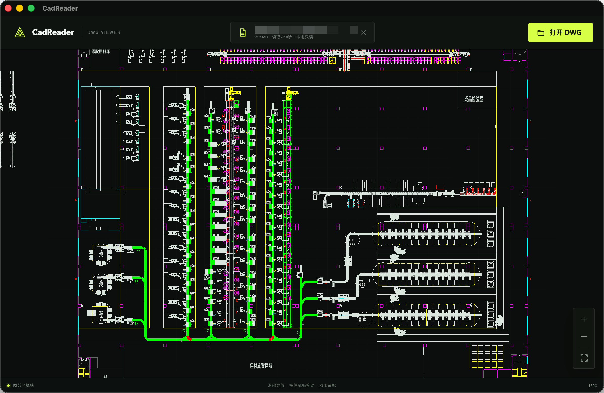
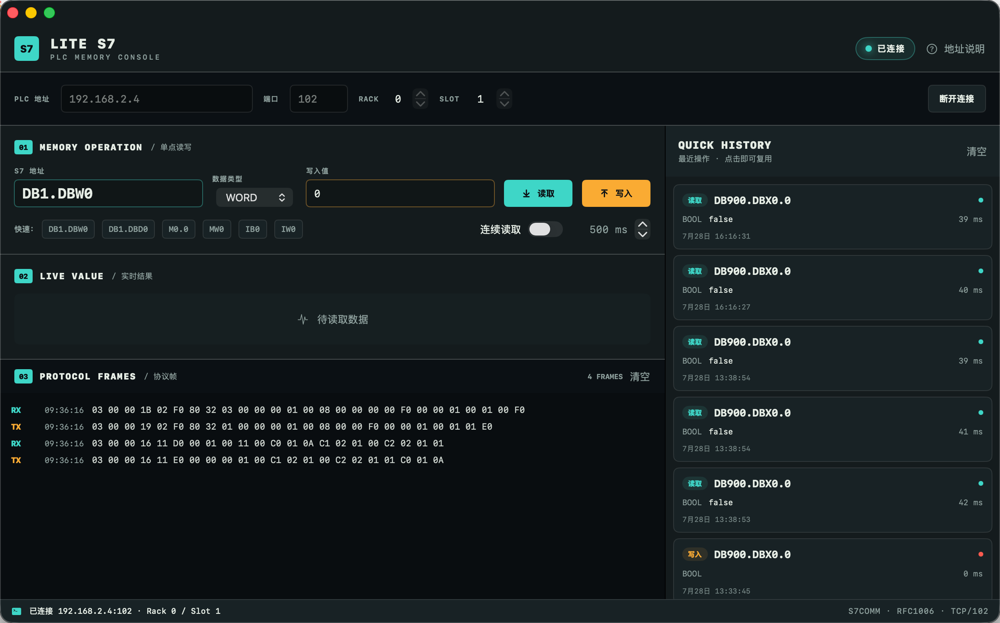

# Tools

面向工程现场的轻量 macOS 工具集。当前包含 DWG 图纸查看器 **CadReader** 和 S7 PLC 调试工具 **LiteS7**，均可本地运行，无需账号或云端服务。

## 下载

前往 [GitHub Release 0.0.1](https://github.com/QiaoGen/Tools/releases/tag/0.0.1)，或直接下载安装包：

| 工具 | 安装包 | 适用平台 |
| --- | --- | --- |
| CadReader | [CadReader_0.1.0_aarch64.dmg](https://github.com/QiaoGen/Tools/releases/download/0.0.1/CadReader_0.1.0_aarch64.dmg) | macOS · Apple Silicon |
| LiteS7 | [LiteS7-0.1.0.dmg](https://github.com/QiaoGen/Tools/releases/download/0.0.1/LiteS7-0.1.0.dmg) | macOS · Apple Silicon |

## CadReader

轻量、只读的本地 DWG 图纸查看器。使用 WebAssembly 解析图纸并通过 WebGL 渲染，文件始终保留在本机。

- 打开或拖入 `.dwg` 文件
- 鼠标缩放、拖动平移和一键适合窗口
- WebGL 渲染，DWG 解析运行在独立线程
- Tauri 桌面应用，无后端、无上传

[查看 CadReader 详细说明](CadReader/README.md)

## LiteS7

面向 Siemens S7 PLC 的原生 macOS 调试工具，直接实现 S7comm / ISO-on-TCP 通讯，不依赖第三方运行时。

- 支持 S7-300/400/1200/1500
- 读取 DB、M、I、Q 区域，写入 DB、M 区域
- 支持 BOOL、BYTE、INT、WORD、DINT、DWORD、REAL
- 连续轮询、操作历史和协议帧查看
- 原生 SwiftUI 界面

[查看 LiteS7 详细说明](LiteS7/README.md)

## 从源码运行

两个工具的构建方式和使用说明分别记录在各自目录：

- [CadReader 构建说明](CadReader/README.md#启动)
- [LiteS7 构建说明](LiteS7/README.md#构建与运行)

## License

本仓库采用 [MIT License](LICENSE)。CadReader 使用的 `@flyfish-dev/cad-viewer` 以 AGPL-3.0-only 许可证发布，使用和分发前请同时遵守其许可证要求。
